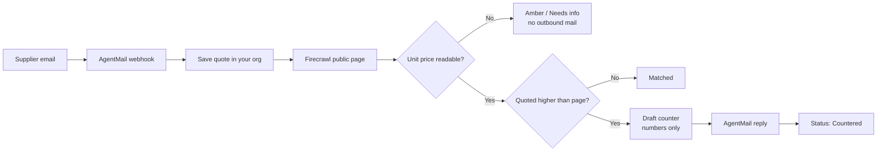
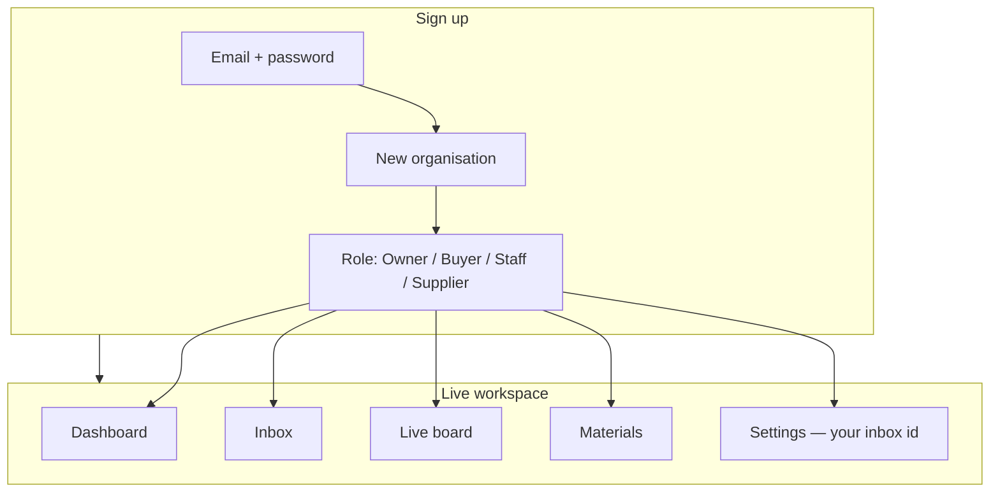

# YARD

**Check a supplier quote against that supplier’s own public page. Reply with a counter only when the quoted unit price is high.**

Live app: [https://brainy-horse-649.convex.site](https://brainy-horse-649.convex.site)  
Event: [Convex All Gas Hackathon](https://convex.dev) · Submit on vibeapps  
Repo: [github.com/henrysammarfo/yard](https://github.com/henrysammarfo/yard)

---

## What it does

Buyers still get prices by email. Those prices are easy to overpay on.

YARD:

1. Receives the supplier email (AgentMail)
2. Reads the unit price on the supplier’s **public** product page (Firecrawl)
3. Compares quoted unit price vs page unit price
4. **Only if the email is higher** — drafts a short counter from those two numbers and sends it back
5. If the page price cannot be read — keeps the quote amber and **does not** send mail

Each signup creates its **own organisation**. Judges and owners do not share data.

---

## How the quote loop works





---

## What ships today (working on prod)

| Area | What you get |
| --- | --- |
| Marketing site | Home, how it works, pricing, about, security, contact, FAQ |
| Auth | Email + password (Convex Auth). No Google / GitHub buttons |
| Multitenant orgs | One org per signup; all queries scoped by `orgId` |
| Roles | Owner → dashboard · Buyer → board · Staff → inbox · Supplier → portal |
| Role gates | Wrong-role pages blocked (e.g. buyer cannot open Settings) |
| Inbox | Inbound AgentMail → quote rows for **your** org |
| Live board | Quoted vs page price, status, variance, realtime |
| Approvals | Approve / reject → purchase orders |
| Materials | Add product + public URL → Firecrawl price check |
| Suppliers | Add suppliers per org |
| Supplier portal | Submit a unit price for a live Firecrawl check |
| Activity | Mail, crawl, counter, approve trail |
| Team | Invite members who already signed up |
| Settings | Notify email, assignee, **your** AgentMail inbox id — values persist |

**Live spine proven:** high inbound quote → Firecrawl page price → numbers-only counter reply via AgentMail.

---

## Try it (2 minutes)

1. Open [https://brainy-horse-649.convex.site/auth](https://brainy-horse-649.convex.site/auth)
2. Create an **Owner** account (fresh email)
3. Settings → Inbox → paste `yard-allgas@agentmail.to` → Save
4. Materials → add a product with this public page:

   `https://books.toscrape.com/catalogue/a-light-in-the-attic_1000/index.html`

5. Supplier portal → submit unit price `40` (should **Match**) and `99.5` (should **Counter**)
6. Watch **Live board** and **Activity**

Copy-paste demo sheet: [`docs/DEMO_PASTE.md`](docs/DEMO_PASTE.md)  
Talk track for video: [`docs/DEMO_SCRIPT.md`](docs/DEMO_SCRIPT.md)

---

## Tech stack

| Layer | Choice |
| --- | --- |
| Backend + DB + realtime | [Convex](https://convex.dev) |
| Auth | [`@convex-dev/auth`](https://labs.convex.dev/auth) (password) |
| Email in / out | [`@agentmail/convex`](https://www.agentmail.to) |
| Page price extract | [`@firecrawl/firecrawl-convex`](https://www.firecrawl.dev) |
| Counter wording | OpenAI-compatible draft via AgentRouter (numbers from extract only) |
| Frontend | TanStack Start + React + Vite + Tailwind |
| Hosting | [`@convex-dev/static-hosting`](https://www.convex.dev) → `*.convex.site` |

### Convex surface used

Schema · indexes · queries · mutations · actions · HTTP actions · scheduled functions · realtime queries · components (Firecrawl, AgentMail, Auth, static hosting)

---

## Repo map

```
convex/           Backend: auth, orgs, quotes, email webhook, crawl, materials
src/components/   Marketing + CRM UI
src/routes/       Pages
src/lib/          Session, yard data hooks
docs/             Demo paste sheet, talk track, challenge notes
hackathon.md      Required All Gas build log
public/           Favicon, OG image
```

Secrets live in **Convex environment variables only** — not in this repo.  
`.env.local` is gitignored. `.env.example` has empty placeholders only.

---

## Local development

```sh
git clone https://github.com/henrysammarfo/yard.git
cd yard
npm install
npx convex dev          # links your Convex project
npm run dev             # Vite app
```

Set on your Convex deployment (Dashboard → Settings → Environment Variables):

- `FIRECRAWL_API_KEY`
- `AGENTMAIL_API_KEY`
- `AGENTMAIL_WEBHOOK_SECRET` (if using signed webhooks)
- `AGENTROUTER_API_KEY` (or rely on template draft fallback)
- Auth: `JWT_PRIVATE_KEY`, `JWKS`, `SITE_URL`

Deploy frontend to Convex static hosting:

```sh
npm run build
npx @convex-dev/static-hosting deploy --dist .output/public --skip-convex
```

---

## Design rules we kept

- Fail-closed: no inventing unit prices
- Public pages only (login walls stay amber)
- Org isolation on every query / mutation
- LLM may phrase a counter around extracted numbers — never invent a figure

---

## Hackathon

- **Event:** Convex All Gas Hackathon  
- **Build log:** [`hackathon.md`](hackathon.md)  
- **Submission copy:** [`docs/SUBMISSION_FORM.md`](docs/SUBMISSION_FORM.md)

Built by Henry Marfo.
